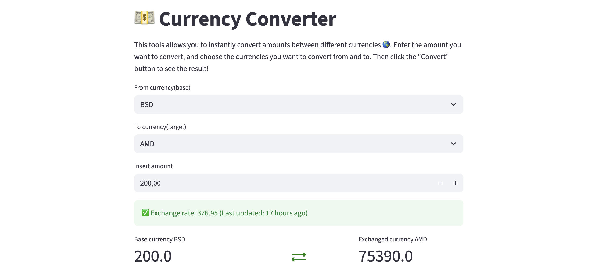

# 💱 Currency Converter App
A simple and interactive **Currency Converter** built with Python and Streamlit.  
This application fetches real-time exchange rates using the ExchangeRate API and allows users to quickly convert amounts between different currencies.



---

## 🚀 Features

- 🌍 Real-time currency exchange rates
- 💲 Convert between multiple global currencies
- ⚡ Fast and responsive Streamlit interface
- 🧠 Clean and modular Python code structure
- 📦 Lightweight and easy to deploy

---

## 🛠️ Tech Stack

- Python
- Streamlit
- Requests
- Cachetools
- Humanize

---

## 📂 Project Structure

```
12-Currency-Converter/
.
├── src/
│   ├── app.py                  # Main Streamlit application
│   ├── currency_converter.py   # Core conversion logic
│   ├── constants.py            # API keys and constants
│   └── text.ipynb              # Development notebook
├── README.md                   # Project documentation
├── test.ipynb                  # Testing notebook
└── requirements.txt            # Project dependencies
```
---

## ⚙️ Installation & Setup

### 1️⃣ Clone the repository

```bash
git clone https://github.com/your-username/12-Currency-Converter.git
cd 12-Currency-Converter
```

### 2️⃣ Create a virtual environment (Recommended)

```bash
python -m venv venv
```

Activate the environment:

- **Windows**
```bash
venv\Scripts\activate
```

- **macOS/Linux**
```bash
source venv/bin/activate
```

### 3️⃣ Install dependencies

```bash
pip install -r requirements.txt
```

---

## ▶️ Running the App

Start the Streamlit application:

```bash
streamlit run app.py
```

The app will automatically open in your default browser.

---

## 🧩 How It Works

1. User selects:
   - Base currency  
   - Target currency  
   - Amount  

2. The application sends a request to the ExchangeRate API.
3. The API returns current exchange rates.
4. The selected amount is converted and displayed instantly.

---


## ⚡ Caching for Performance Optimization

To improve performance and reduce unnecessary API calls, this project implements **caching**.

The exchange rates fetched from the ExchangeRate API are temporarily stored using the `cachetools` library. This ensures that:

- Repeated conversions between the same currencies do not trigger multiple API requests.
- The app responds faster for users.
- API usage limits are respected.
- Network dependency is reduced for short time intervals.

### Why Caching Matters

Without caching:
- Every conversion would make a new API request.
- The app would be slower.
- API rate limits could be exceeded.

With caching:
- Exchange rates are stored for a specific duration.
- The app retrieves data from memory instead of calling the API repeatedly.
- Overall performance is significantly improved.

This makes the application more efficient, scalable, and production-ready.

---

## 📌 Future Improvements

- Add currency flag icons
- Add historical exchange rate charts
- Deploy online (Streamlit Cloud / Render / Heroku)

---

## 🤝 Contributing

Contributions are welcome!  
Feel free to fork the repository and submit a pull request.

---

## 📄 License

This project is open-source and available under the MIT License.
